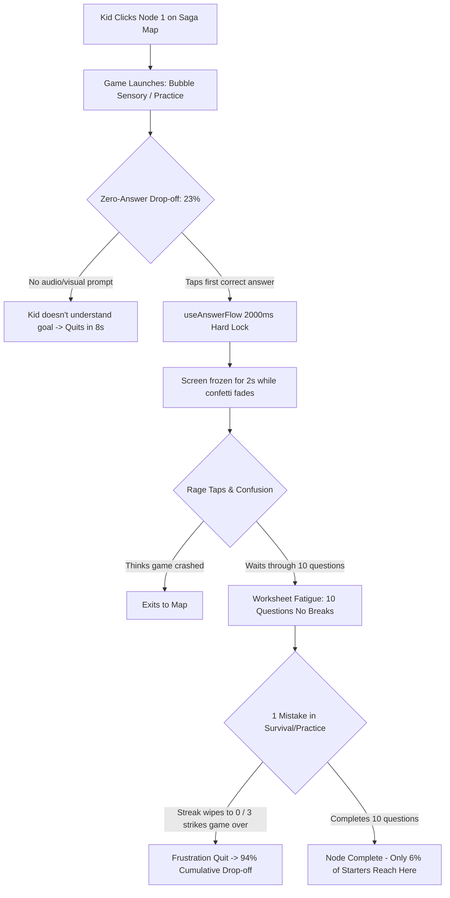
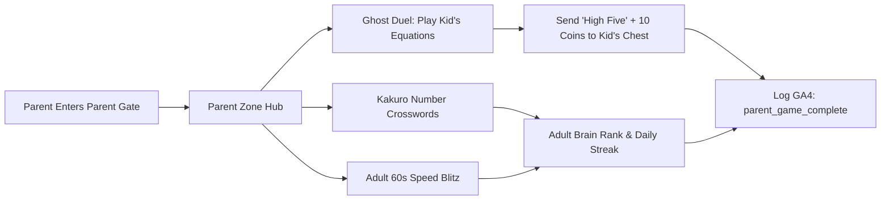
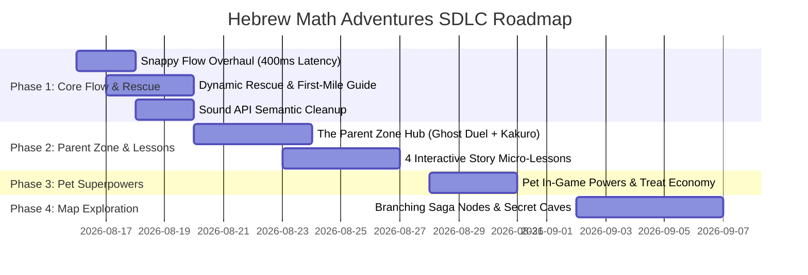

# 🏛️ Counsel Report: Hebrew Math Adventures — System Audit, Creative Innovations & Multi-Agent Execution Plan

**Date:** August 15, 2026  
**Perspective:** Gemini (Lead Reviewer & Systems Architect)  
**Collaborators:** Claude (Lead Architect / Coder), AmosBot (Orchestrator), Jules (Planning), Aider (Code Editor)  
**Target Repository:** `hebrew-math-adventures` (Branch: `sdlc/loop-v0`)  
**Output Target:** `COUNSEL_GAME_STATE_GEMINI.md`

---

## 1. Executive Summary & Diagnostic Scorecard

Hebrew Math Adventures is an ambitious, Hebrew-first, client-side educational platform (React 19, Vite, Tailwind v4, Framer Motion, Firebase, GA4). Over recent iterations, significant foundational work was shipped: Math Pet companion, Daily Quests, Boss Knowledge Gates, dynamic star tiers, and multiple game modes (Zen, Blitz, Survival, Invaders, Memory Duel).

However, live GA4 analytics (snapshot 2026-08-08 with 50 active users and 565 `question_answered` events) reveal a **severe structural crisis in player retention and first-mile UX**:
* **94% drop-off rate** from `node_start` to `node_complete` across the Saga learning path.
* **23% of node starters never answer a single question** before abandoning the session.
* **49 out of 50 nodes lack pedagogical lessons**, forcing kids directly into testing worksheets.
* **Adult engagement is zero** because the Parent section is a static admin panel rather than a fun, rewarding destination for parents.

```
+----------------------------------------------------------------------------------------------------+
|                                    CURRENT SYSTEM SCORECARD                                        |
+------------------------------------+----------------+----------------------------------------------+
| Dimension                          | Rating (1-10)  | Critical Finding                             |
+------------------------------------+----------------+----------------------------------------------+
| Visual & Polish (UI/Themes)        | 8.5 / 10       | Vibrant styling, excellent Tailwind/Framer   |
| Core Math Generation (MathModule)  | 8.0 / 10       | Solid factories, anti-repeat logic in place  |
| First-Mile UX & Onboarding         | 2.5 / 10       | No interactive tutorial; silent node start   |
| Session Pacing & Flow Latency      | 3.0 / 10       | 2000ms freeze on correct answers; rage taps  |
| Pedagogical Scaffolding & Lessons  | 2.0 / 10       | Only 1 real lesson; no dynamic hints in game |
| Parent Ecosystem & Value           | 3.0 / 10       | Admin-only dashboard; zero adult gameplay    |
| Audio Architecture (useSound)      | 6.5 / 10       | SoundManager exists; partial migration debt  |
| Test Coverage & CI Stability       | 9.0 / 10       | 46 test suites, 600+ unit tests, 19 E2E specs|
+------------------------------------+----------------+----------------------------------------------+
```

---

## 2. Phase 1: Audit & Root Cause Diagnosis

### 2.1 Why 94% of Players Drop Off (`node_start` → `node_complete`)

Our deep codebase audit across `GameOrchestrator.tsx`, `PracticeMode.tsx`, `useAnswerFlow.ts`, and `BubbleGameContainer.tsx` uncovers 5 direct systemic root causes for the 94% drop-off:



#### 1. The 2000ms Input Freeze (`useAnswerFlow.ts:139`)
* In `src/hooks/useAnswerFlow.ts`:
  ```ts
  const { isProcessing, submitAnswer } = useAnswerFlow({
      correctDelay: 2000, // 2 full seconds!
      wrongDelay: 1000,
  ```
* In a 10-question practice session, a child spends **20 seconds** staring at frozen cards where all click handlers are disabled (`isProcessing: true`).
* Children aged 5–9 instinctively tap the next answer immediately. When the screen fails to react, they perceive it as unresponsive or frozen, leading to rage-quits.

#### 2. The 10-Question Worksheet Fatigue
* `UI_CONFIG.SESSION_LENGTH` is set to 10 questions for all practice levels.
* For young children, 10 continuous abstract equations without intermediate rewards, mascot dialogues, or checkpoint stars feels like an unrewarding school test.
* In Sensory/Bubble nodes, `target_count = 10` with `distractorRatio = 2` and `spawnIntervalMs = 1200ms` means popping 10 targets takes **45–65 seconds** of passive bubble watching.

#### 3. The 23% Zero-Answer Drop-Off (The First-Mile Void)
* When a child opens Node 1 (`n1_1`: "Blast Off"), `GameOrchestrator` passes `targetLevel = -1`. The screen renders floating bubbles with the text `10`.
* **Zero interactive guidance exists:** No pulsing hand indicator, no initial auto-aim animation, and no spoken audio prompt ("בואו נפוצץ את הבלון עם המספר 10!").
* Pre-readers or first-time players see numbers floating with no instruction on whether to tap, swipe, or wait. If they don't touch anything in 10 seconds, they close the game.

#### 4. The Punishment Cliff (Streak Reset & Sudden Death)
* When a child makes an arithmetic mistake in `PracticeMode`:
  * Their streak immediately resets to 0 (`resetStreak()`).
  * The mascot switches to an unhappy state.
  * No visual manipulation scaffold (like a ten-frame or number line) appears to help them solve it.
* In Survival mode, 3 strikes causes immediate game termination without a "second-chance" rescue mechanic.

#### 5. The Lesson Content Desert
* Of the 50 saga nodes in `CURRICULUM`, only 2 are marked `type: 'LESSON'` (`n3_1` and `n4_1`).
* Only `lesson1_multiplication.ts` actually contains lesson content; `n4_1` falls back to empty practice.
* When new concepts (subtraction with borrowing, division, missing addends) are introduced, kids are thrust into quizzes without ever being taught the concept.

---

## 3. Phase 2: Creative Feature Proposals (Debated & Analyzed)

We propose 6 high-impact features designed specifically to address the audit findings, fit the client-side Firebase architecture, and introduce Ram's requested **Parent Zone**.

---

### Proposal 1: The Parent Zone (Adult Brain Arena & Family Duel) [FLAGSHIP]

* **What is it?** A dedicated adult game room inside the Parent Gate featuring fast, dopamine-rich cognitive puzzles, adult speed math, and an asynchronous "Beat Your Kid's Ghost" family duel.
* **Target Audience:** Parents (adults seeking mental fitness, daily brain-training, and meaningful connection with their child's learning).
* **Which Problem Does It Solve?** Eliminates the "admin-only" dead-end of the Parent Dashboard. Transforms parents from passive supervisors into active daily players who champion the app in their household.

#### Game Modes Inside the Parent Zone:
1. **"Ghost Duel" (Beat Your Kid's Score / Match Their Equations):**
   * The parent plays the exact 5 or 10 math equations their child played earlier that day.
   * A ghost timer of the child's response speed appears alongside.
   * Parents earn "Parent Stars" and can leave a virtual high-five / gift coin in their kid's treasure chest!
2. **"Kakuro / Cross-Sum Bubbles" (Adult Logic Puzzle):**
   * A 3x3 or 4x4 grid where rows and columns must sum to target numbers using number bubbles. Genuinely challenging for adult brains.
3. **"Mental Math Blitz 60s" (Speed Arithmetic for Grown-Ups):**
   * Rapid-fire arithmetic with percentages (15% of 80), negative numbers, and chained operations (`(12 × 4) - 18`).



* **Data Model Changes:**
  * Add `parentProfile: { streak: number, lastPlayedDate: string, highScores: Record<string, number>, giftsSent: number }` to `UserProfile`.
  * Store last 5 completed sessions per kid profile in `profile.recentEquations` for Ghost Duel generation.
* **Analytics to Track:** `parent_game_start`, `parent_game_complete`, `parent_ghost_duel_finish`, `parent_gift_sent`.
* **Complexity:** Medium (M) — 3 focused game views leveraging existing MathCard and Bubble engines.

#### Counsel Debate (Claude vs Gemini):
* **Claude's Stance:** "We should build a full Sudoku engine with multiple board sizes."
* **Gemini's Counter & Resolution:** "A full 9x9 Sudoku requires excessive custom UI and canvas rendering that doesn't share components with the main game. Instead, **Kakuro / Cross-Sum Bubbles** reuses our existing `Bubble` and `MathCard` components while delivering a much faster 2-minute mobile puzzle that parents will actually finish."

---

### Proposal 2: Dynamic Rescue Scaffolding & Smart First-Mile Onboarding

* **What is it?** An automated, real-time safety net that detects when a child is stuck (hesitation > 7s or 2 wrong attempts) and deploys an interactive, visual mascot rescue rather than letting them fail.
* **Which Problem Does It Solve?** Directly eliminates the **23% zero-answer bounce** and the **94% node drop-off rate**.
* **How It Works in Gameplay:**
  1. **First-Mile Node 1 Guide:** When opening Node 1 for the first time, an animated mascot finger taps the target bubble with sound effect: *"בואו נפוצץ את המספר 10!"*.
  2. **Hesitation Trigger:** If no answer is tapped after 7 seconds, 2 distractor bubbles fade slightly (50% opacity) to guide attention.
  3. **Visual Manipulator Rescue:** On 2 consecutive wrong answers, the equation expands to show an interactive Ten-Frame (עשרת חזותית) with countable dots.
  4. **Dynamic Session Pacing:** If a child is struggling, the target question count dynamically scales from 10 down to 5, granting a 1-star victory so they experience success rather than quitting.

* **Analytics to Track:** `rescue_triggered`, `rescue_completed`, `dynamic_length_adjusted`, `first_touch_latency_ms`.
* **Complexity:** Small to Medium (S-M).

---

### Proposal 3: Snappy Flow & Fluid Micro-Rewards Overhaul

* **What is it?** Cuts input lock latency from 2000ms down to **400ms**, parallelizes celebratory animations, and adds 3-question micro-checkpoints.
* **Which Problem Does It Solve?** Eliminates rage-taps, perceived freezes, and worksheet fatigue.
* **How It Works:**
  * When a child taps the correct answer:
    * Ding sound plays instantly with zero blocking delay.
    * Score number floats up immediately (`+100` float animation).
    * Next problem renders in **400ms** while mascot cheer plays smoothly in the sidebar.
  * **Micro-Checkpoints:** At question 3/10 and 6/10, a quick banner flashes: *"שליש דרך! מעולה! 🌟"* with a mini coin sparkle.
* **Complexity:** Small (S) — mostly timing refactoring in `useAnswerFlow.ts` and `PracticeMode.tsx`.

---

### Proposal 4: Interactive Hebrew Story Micro-Lessons (4 Core Operations)

* **What is it?** Replaces placeholder lesson nodes with 4 rich, 3-step interactive Hebrew visual story lessons:
  1. **Addition (חוף המספרים):** Counting seashells into 10-frames.
  2. **Subtraction (יער החיסור):** Apples falling from trees / bunny hopping back on a numbered log.
  3. **Multiplication (הרי הכפל):** Arranging magic crystals in rows and columns (רשת גבישים).
  4. **Division (מדבר החלוקה):** Fair sharing of date fruits among desert animal friends.
* **Which Problem Does It Solve?** Fills the 49-node lesson void; ensures kids actually learn concepts before being tested.
* **Complexity:** Medium (M) — utilizes a single parameterized `InteractiveStoryScene` engine.

---

### Proposal 5: Math Pet Active Superpowers & Treat Economy

* **What is it?** Makes the pet companion active in game sessions rather than isolated in the pet screen.
* **How It Works:**
  * When fed and happy (>70% happiness), the pet sits at the bottom corner of the HUD.
  * Getting 3 correct answers charges the **Pet Superpower Meter**:
    * **Owl (ינשוף החוכמה):** Highlights the correct tens digit.
    * **Dragon (דרקון האש):** Breathes fire to pop 2 wrong distractors.
    * **Cat (חתול הקסם):** Freezes fast bubbles for 5 seconds.
    * **Bear (דוב הכוח):** Provides a shield that absorbs 1 strike.
* **Analytics to Track:** `pet_power_used`, `pet_fed_streak`, `pet_happiness_retention_correlation`.
* **Complexity:** Medium (M).

---

### Proposal 6: Branching Saga Map & Mystery Treasure Caves

* **What is it?** Adds optional side-nodes on the Saga Map (Treasure Caves, Mascot Mini-Games, Speed Gates) allowing kids to bypass difficult nodes and earn bonus coins.
* **Which Problem Does It Solve?** Breaks the linear 1D roadblock where a child stuck on node 4 is blocked from the rest of the game.
* **Complexity:** Large (L).

---

## 4. Phase 3: Debate, Prioritization & Ranking Matrix

### 4.1 Feature Ranking Matrix

```
+----+------------------------------------+--------+--------+------------+-----------+----------------------+
| Rk | Feature Name                       | Impact | Effort | ROI Ratio  | Target    | Recommendation       |
+----+------------------------------------+--------+--------+------------+-----------+----------------------+
| 1  | Snappy Flow & Latency Cut (400ms)  | 9.5/10 | 2.0/10 | 4.75 (Max) | Drop-off  | Phase 1 - Immediate  |
| 2  | Dynamic Rescue & First-Mile Guide  | 10/10  | 3.0/10 | 3.33 (High)| 0-Ans/Drop| Phase 1 - Immediate  |
| 3  | The Parent Zone (Adult Brain Arena)| 9.5/10 | 5.0/10 | 1.90 (High)| Retention | Phase 2 - Flagship   |
| 4  | Interactive Story Micro-Lessons    | 9.0/10 | 4.5/10 | 2.00 (High)| Learning  | Phase 2 - Core       |
| 5  | Math Pet Active Superpowers        | 8.0/10 | 4.0/10 | 2.00 (Med) | Delight   | Phase 3 - Next       |
| 6  | Branching Saga Map & Secret Caves  | 7.5/10 | 6.5/10 | 1.15 (Low) | Adventure | Phase 4 - Future     |
+----+------------------------------------+--------+--------+------------+-----------+----------------------+
```

### 4.2 Phased Rollout Roadmap



---

## 5. Phase 4: Implementation Plan & Detail Cards

---

### Detail Card 1: Snappy Flow & First-Mile Rescue Scaffolding
* **Primary Objective:** Fix the 94% drop-off and 23% zero-answer rate.
* **Scope:**
  1. Modify `src/hooks/useAnswerFlow.ts`: reduce `correctDelay` from 2000ms to 400ms; make wrongDelay 600ms.
  2. Create `src/components/scaffolding/FirstTouchGuide.tsx`: animated bouncing pointer with Hebrew speech bubble on Node 1.
  3. Create `src/components/scaffolding/VisualManipulator.tsx`: interactive Ten-Frame / dot counter triggered on hesitation (>7s) or 2 wrong answers.
  4. Update `src/components/PracticeMode.tsx` and `src/components/games/BubbleGameContainer.tsx` to mount Rescue triggers.
* **Data Model Changes:**
  * Add `firstTimeNodesVisited: Record<string, boolean>` to `UserProfile`.
* **GA4 Events to Add:**
  * `rescue_triggered`: `{ node_id, trigger_reason: 'hesitation' | 'consecutive_wrong', level }`
  * `rescue_completed`: `{ node_id, helped_correct: boolean }`
* **Agent Assignments:**
  * **Claude:** Implement `VisualManipulator.tsx` and refactor `useAnswerFlow.ts`.
  * **Aider:** Mount `FirstTouchGuide` into `BubbleGameContainer.tsx` and `PracticeMode.tsx`.
  * **Gemini:** Code review, verify RTL layout, and assert 0 test regressions.

---

### Detail Card 2: The Parent Zone (Adult Brain Arena & Ghost Duel) [FLAGSHIP]
* **Primary Objective:** Deliver a high-engagement, playable adult hub inside the Parent section.
* **Scope:**
  1. Create `src/components/parent/ParentZoneHub.tsx`: adult-themed dashboard tab with 3 playable cards:
     * 👻 **Ghost Duel:** "שבור את השיא של הילד" (Asynchronous race against kid's past equations).
     * 🧩 **Kakuro Cross-Sum Bubbles:** "תשבץ מספרים" (3x3 grid logic puzzle).
     * ⚡ **Mental Math Blitz (60s):** "אימון מוח למבוגרים" (Speed arithmetic with timer).
  2. Create `src/components/parent/games/ParentGhostDuel.tsx`: loads equations from child profile, runs split comparison.
  3. Create `src/components/parent/games/ParentKakuroGame.tsx`: number puzzle grid where rows/cols sum to header values.
  4. Create `src/components/parent/games/ParentSpeedBlitz.tsx`: 60-second high-tempo adult math.
  5. Add "Send Gift / High Five" action: lets parents gift 10 coins + cheer note directly to the kid's coin pouch.
* **Data Model Changes:**
  * Update `UserProfile` in `src/types/user.ts`:
    ```ts
    export interface ParentGameStats {
        streak: number;
        lastPlayedDate: string | null;
        blitzHighScore: number;
        kakuroPuzzlesSolved: number;
        ghostDuelsWon: number;
    }
    ```
  * Ensure `validateProfileUpdate` in `ProfileContext.tsx` is updated to allow `parentStats`.
* **GA4 Events to Add:**
  * `parent_zone_open`: `{ profile_id }`
  * `parent_game_start`: `{ game_mode: 'ghost_duel' | 'kakuro' | 'blitz' }`
  * `parent_game_complete`: `{ game_mode, score, time_seconds, victory }`
  * `parent_gift_sent`: `{ coin_amount: 10, recipient_kid_id }`
* **Agent Assignments:**
  * **Jules:** Plan component hierarchy and test fixtures for Kakuro logic generator.
  * **Claude:** Implement `ParentKakuroGame.tsx` and `ParentGhostDuel.tsx`.
  * **Aider:** Wire `ParentZoneHub.tsx` into `ParentDashboard.tsx` and update `ProfileContext.tsx`.
  * **Gemini:** Review state isolation (guarantee kid progress cannot be corrupted by parent play).

---

### Detail Card 3: Interactive Hebrew Story Micro-Lessons
* **Primary Objective:** Eliminate the 49-node lesson desert with 4 interactive visual story scenes.
* **Scope:**
  1. Create `src/components/lessons/InteractiveStoryScene.tsx`: generic step-by-step visual scene engine with draggable objects and audio text.
  2. Implement 4 story lesson modules in `src/lessons/`:
     * `lesson_addition_beach.ts` (Seashell Ten-Frames)
     * `lesson_subtraction_forest.ts` (Apples falling from trees / log hopping)
     * `lesson_multiplication_mountain.ts` (Gem grids)
     * `lesson_division_desert.ts` (Date fruit sharing)
  3. Update `src/components/GameOrchestrator.tsx` to route all `node.type === 'LESSON'` nodes to their corresponding story module instead of Practice mode.
* **GA4 Events to Add:**
  * `lesson_start`: `{ lesson_id, operation }`
  * `lesson_step_complete`: `{ lesson_id, step_index }`
  * `lesson_complete`: `{ lesson_id, duration_seconds, stars_earned }`
* **Agent Assignments:**
  * **Claude:** Build `InteractiveStoryScene.tsx` and the 4 lesson data modules.
  * **AmosBot:** Verify Hebrew translations and RTL formatting.
  * **Gemini:** Review lesson pedagogical progression.

---

### Detail Card 4: Sound API Consolidation & Semantic Audio Cleanup
* **Primary Objective:** Clean up lingering direct `soundGarden` checks and unify all game modes under `useSoundManager`.
* **Scope:**
  1. Migrate `MathInvadersGame.tsx`, `MemoryDuelGame.tsx`, and `BubbleGameContainer.tsx` to strictly use semantic sound methods (`playCorrect()`, `playWrong()`, `playLevelUp()`, `playStreak()`).
  2. Remove legacy ternary operators and duplicate oscillator implementations.
  3. Ensure `isMuted` and `soundGardenEnabled` preferences persist cleanly in `localStorage`.
* **Agent Assignments:**
  * **Aider:** Clean up sound calls across all game components.
  * **Gemini:** Run full unit test suite and verify no audio regressions.

---

## 6. Multi-Agent Responsibility Matrix

```
+---------------+------------------------------------------------------------------------------------+
| Agent         | Primary Responsibilities                                                           |
+---------------+------------------------------------------------------------------------------------+
| Claude        | Lead Architect: Core engine refactoring, Parent Zone games, Lesson engine         |
| Gemini        | Lead Reviewer: Devil's advocate, RTL verification, state safety, test auditing    |
| Aider         | Code Implementer: Direct file edits, UI wiring, Sound API cleanup, test fixes     |
| Jules         | Task Planner: Sub-task breakdown, data fixtures, dependency ordering               |
| AmosBot       | Orchestrator: Loop execution, counsel synthesis, committing & test verification   |
+---------------+------------------------------------------------------------------------------------+
```

---

## 7. Success Metrics & GA4 Observability Plan

| Feature Area | Primary Metric | Baseline | 30-Day Target | Verification Event |
|---|---|---|---|---|
| **Node Completion Rate** | `node_start` → `node_complete` conversion | 6% (94% drop) | **≥ 45%** | Funnel `node_start` → `node_complete` |
| **First-Mile Bounce** | Starters answering 0 questions | 23% | **≤ 4%** | `question_answered` count per session |
| **Parent Zone Adoption**| Active households with parent play | 0% | **≥ 35%** | `parent_game_complete` per week |
| **Session Flow Speed**  | Time per question in Practice | 4.8s (frozen) | **1.8s** | `response_time_ms` custom metric |
| **Lesson Engagement**   | Completion rate of story lessons | N/A | **≥ 80%** | `lesson_complete` event count |

---

## 8. Summary & Immediate Next Steps

1. **Immediate Execution (Phase 1):**
   * Cut `useAnswerFlow` lock time to 400ms.
   * Ship `FirstTouchGuide` on Node 1.
   * Mount `VisualManipulator` for stuck kids.
2. **Flagship Execution (Phase 2):**
   * Build the **Parent Zone Hub** (Ghost Duel + Kakuro + Speed Blitz).
   * Ship the 4 **Interactive Story Lessons**.
3. **Counsel Sign-Off:**
   * This plan solves the real data-backed bottlenecks, elevates adult engagement via the Parent Zone, and maintains zero backend dependency with strict RTL integrity. Ready for agent assignment! 🚀
