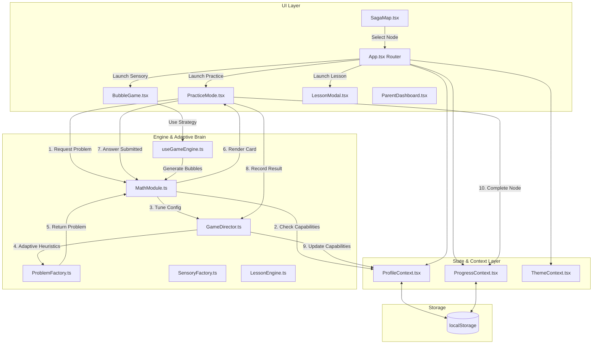

# Product Overview & Audit Document — Hebrew Math Adventures (הרפתקאות חשבון)

---

## 1. Product Summary

**Hebrew Math Adventures (הרפתקאות חשבון)** is a mobile-first, gamified math learning web application designed specifically for Israeli children (Ages 5–11+, Preschool through Grade 6/7). 

### Core Purpose & Value Proposition
- **Language & Cultural Context:** Built natively in Hebrew with full Right-to-Left (RTL) support, kid-friendly typography (Rubik font), and culturally aligned age brackets.
- **Pedagogical Philosophy ("Smart Fun"):** Combines structured elementary math practice (Common Core & Israeli curriculum alignment) with gaming mechanics (XP, streaks, animated mascot companions, interactive story lessons, arcade modes, and bubble-pop sensory games).
- **Target Audience:**
  - **Children (Primary Users):** Practice math skills through engaging saga maps, visual hints, and gamified challenges.
  - **Parents & Educators:** Manage child profiles, track basic streak/age stats, and control local settings behind a protected math gate.
- **Problems Solved:**
  - Overcomes math anxiety in young learners through positive reinforcement and non-punitive adaptive difficulty.
  - Eliminates mobile input friction by providing custom numeric keypads and interactive visual manipulators instead of system soft keyboards.
  - Provides offline-first, friction-free access without requiring cloud login or subscriptions.

---

## 2. Feature Inventory

The following table details every user-facing and architectural feature identified across the codebase:

| Feature Name | Description | Location (File & Lines) | Status | Code Evidence / Notes |
| :--- | :--- | :--- | :--- | :--- |
| **Multi-Profile Management** | Create, switch, and delete up to 10 child profiles with custom names, ages (4–12), avatar emojis, and mascot companions. | `src/context/ProfileContext.tsx#L162-L211`, `src/components/onboarding/ProfileSelector.tsx#L38-L144`, `src/components/ProfileSetup.tsx#L24-L132` | **Works** | Full persistence in `localStorage` under `hebrew-math-profiles`. Validates profile names (`isValidProfileName`) and caps profiles at 10. |
| **Parent Gate & Security Challenge** | Password/Math gate protecting parent controls from young children via a dynamic addition problem ($N_1 + N_2 = ?$). | `src/components/parent/ParentGate.tsx#L10-L104`, `src/App.tsx#L70-L79` | **Works** | Uses `crypto.getRandomValues()` to generate two-digit addition problems. Bypasses only when solved correctly. |
| **Parent Dashboard** | Admin table listing all child profiles, age, assigned mascot, current streak, with edit modal and reset data option. | `src/components/parent/ParentDashboard.tsx#L12-L141`, `src/components/parent/EditProfileModal.tsx#L15-L174` | **Works** | Provides data grid with inline actions (`EditProfileModal` and `deleteProfile`). Also includes a "Danger Zone" `localStorage.clear()` button. |
| **Saga Map Progression** | Interactive multi-unit map (`unit_1` through `unit_5`) with node types: `PRACTICE`, `SENSORY`, `LESSON`, `CHALLENGE`. | `src/components/map/SagaMap.tsx#L41-L209`, `src/data/learningPath.ts#L3-L99`, `src/context/ProgressContext.tsx#L19-L139` | **Works** | Node progress (`stars`, `isLocked`) persists per profile (`hebrew_game_saga_progress_v1_<id>`). Initial unit unlocked based on child age (`getInitialProgress`). |
| **Legacy Zone Map** | Alternative theme/zone map (`WORLD_ZONES`) grouping levels into regions like Addition Island, Subtraction Forest. | `src/components/WorldMap.tsx#L29-L78`, `src/components/MapZone.tsx#L15-L95`, `src/lib/worldConfig.ts#L14-L55` | **Partially Works** | Components exist and function independently, but `App.tsx` routes exclusively through `SagaMap.tsx`, leaving `WorldMap.tsx` unlinked in main user flow. |
| **Adaptive Math Engine (MathModule & Director)** | Generates arithmetic, missing operand (algebraic), comparison, series, and word problems tailored to user capability. | `src/engines/MathModule.ts#L7-L82`, `src/engines/ProblemFactory.ts#L49-L256`, `src/engines/GameDirector.ts#L10-L108` | **Works** | Problem factories generate math dynamically. `GameDirector.recordResult()` updates skill stats (`attempts`, `consecutiveCorrect`, `consecutiveFailures`) and tunes parameters. |
| **Adaptive Difficulty Tuning (Rescue & Challenge)** | Dynamically scales problem max bounds or simplifies types when failure threshold ($\ge 2$) or streak threshold ($\ge 5$) is hit. | `src/engines/GameDirector.ts#L20-L70` | **Works** | Deep copies profile capabilities, applies `RESCUE_MULTIPLIER` ($0.8\times$) or `CHALLENGE_MULTIPLIER` ($1.2\times$), and converts complex types (e.g. `sub_borrow` $\rightarrow$ `sub_simple`). |
| **Practice Session & Game Modes** | Practice loop supporting Standard (10 questions), Time Attack (60s timer + time bonus), and Survival (3 lives). | `src/hooks/usePracticeSession.ts#L9-L203`, `src/components/PracticeMode.tsx#L36-L318`, `src/components/games/ModeSelectorOverlay.tsx#L21-L120`, `src/components/games/ArcadeHUD.tsx#L16-L76` | **Works** | Full reducer state machine tracking score, combo multipliers ($1\times$ to $5\times$), lives, and high scores (`updateArcadeBestScore`). |
| **Math Card & Custom Input** | Interactive math card supporting vertical/horizontal arithmetic, series, word problems, comparison buttons ($>, =, <$), and custom numeric input. | `src/components/MathCard.tsx#L21-L265`, `src/components/math-card/ArithmeticView.tsx#L14-L124`, `src/components/math-card/SeriesView.tsx#L13-L50`, `src/components/math-card/ComparisonView.tsx#L13-L62`, `src/components/math-card/NumberInput.tsx#L18-L65` | **Works** | Features auto-focus, regex digit filtering, empty-input shake feedback, and dynamic layout keys preventing stale state across problems. |
| **Visual Animated Hints** | Step-by-step visual explanations for borrowing, carrying, multiplication grids, division grouping, and sub-20 counters. | `src/components/HintVisualizer.tsx#L18-L117`, `src/components/BorrowingHint.tsx#L149-L333`, `src/components/AdditionHint.tsx`, `src/components/SubtractionHint.tsx`, `src/components/MultiplicationHint.tsx`, `src/components/DivisionHint.tsx`, `src/hooks/useMathHint.ts#L3-L41` | **Works** | Modal displays step-by-step column-based digit animations for subtraction borrowing / addition carrying, with interactive prev/next steps. |
| **Sensory Mode (Bubble Pop Game)** | Arcade mini-game where bubbles float up screen; kids pop target numbers or correct math answers. | `src/components/sensory/BubbleGame.tsx#L18-L93`, `src/components/games/BubbleGameContainer.tsx#L25-L160`, `src/engines/bubble/useGameEngine.ts#L4-L203`, `src/engines/bubble/strategies/MathStrategy.ts#L6-L119`, `src/engines/SensoryFactory.ts#L12-L83` | **Works** | Built with `requestAnimationFrame` loop, supports frenzy mode ($\ge 5$ combo), dynamic catch-up spawning, velocity physics, and pop particle effects (`Explosion.tsx`). |
| **Interactive Story Lessons** | Step-by-step guided lessons with drag-and-drop mechanics (e.g. dragging apples into baskets to teach multiplication). | `src/components/lessons/LessonModal.tsx#L17-L197`, `src/engines/LessonEngine.ts#L5-L112`, `src/lessons/lesson1_multiplication.ts#L3-L75`, `src/types/lesson.ts#L1-L47` | **Partially Works** | `LessonEngine` and `LessonModal` work with full drag validation. However, **only 1 lesson** (`lesson1_multiplication.ts`) is implemented in code. Other `LESSON` nodes in curriculum fall back to this or practice. |
| **Mascot System** | Interactive pets (Owl, Bear, Ant, Lion) with distinct emotional states (`idle`, `happy`, `thinking`, `excited`, `encourage`). | `src/components/mascot/Mascot.tsx#L15-L75`, `src/components/mascot/MascotSelector.tsx#L12-L46`, `src/components/mascot/SpeechBubble.tsx#L12-L68` | **Works** | Renders custom SVG mascots with emotion-driven animations, integrated into practice feedback and lesson modals. |
| **Theme Customization System** | Unlockable color schemes & background patterns (Default, Forest, Space, Candy) tied to total stars earned. | `src/context/ThemeContext.tsx#L16-L81`, `src/lib/themes.ts#L20-L96`, `src/components/ThemeSelector.tsx#L12-L55` | **Works** | Sets global CSS variables (`--color-primary`, `--color-background`, etc.) and SVG background patterns on `:root`. Unlocks dynamically as stars increase. |
| **Audio Synthesizer (Web Audio API)** | Synthetic sound effects for correct, wrong, level-up, and click without external audio file dependencies. | `src/hooks/useSound.ts#L12-L115` | **Works** | Uses `AudioContext` oscillators (`sine`, `sawtooth`, `triangle`) with gain nodes and proper `.disconnect()` cleanup to avoid memory leaks or missing asset 404s. |
| **Analytics & Telemetry** | Firebase Analytics wrapper logging app lifecycle, node progression, and question performance. | `src/hooks/useAnalytics.ts#L62-L80`, `src/lib/firebase.ts#L17-L47` | **Works** | Environment-safe: logs to Firebase Analytics if configured; otherwise gracefully falls back to internal console mock logger (`src/lib/logger.ts`). |
| **Internationalization (i18n)** | Bilingual support (Hebrew RTL primary, English LTR secondary) powered by `i18next`. | `src/i18n.ts`, `src/i18n/config.ts`, `src/i18n/locales/he.json`, `src/i18n/locales/en.json` | **Works** | Complete translations for menu items, math problems, saga nodes, parent controls, and feedback phrases. Switches document direction (`dir="rtl"`) dynamically. |

---

## 3. Architecture Overview

### Data Flow Diagram

### Key Architectural Systems

1. **Problem Generation Pipeline:**
   - `MathModule.generateProblem(profile, params)` is the entry point.
   - It computes the effective level, selects a problem category based on level progression rules (`LEVEL_PROGRESSION`), and passes `params` to `Director.tuneConfig(params, profile)`.
   - `GameDirector` applies heuristics (Rescue Mode if `consecutiveFailures >= 2`, Challenge Mode if `consecutiveCorrect >= 5` or `streak > 5`).
   - The selected concrete factory (`ArithmeticFactory`, `AlgebraicFactory`, `ComparisonFactory`, `SeriesFactory`, or `WordProblemFactory`) constructs the typed `Problem` object.

2. **Answer Evaluation & Scoring:**
   - User enters input in `MathCard.tsx` (via `NumberInput.tsx` or comparison buttons).
   - `PracticeMode.tsx` calls `evaluateAnswer()` on `MathModule`, comparing strings/numbers.
   - `Director.recordResult(capabilities, isCorrect)` is invoked immediately:
     - Updates `consecutiveFailures` globally.
     - Deep-copies the skill record for `profile.currentFocus` and updates `attempts`, `correct`, `consecutiveCorrect`, and `consecutiveWrong`.
     - Returns the updated `UserCapabilityProfile`, which is persisted back to `ProfileContext`.
   - XP system is deprecated in favor of **Capability Profiles** and **Stars**.

3. **Adaptive Difficulty Heuristics:**
   - **Rescue Mode Trigger:** `consecutiveFailures >= 2`
     - Action: Multiplies `max` number limit by $0.8$ (min bound 5), simplifies `sub_borrow` to `sub_simple` and `addition_carry` to `addition_simple`, forces series step to 1, and reduces sensory bubble density.
   - **Challenge Mode Trigger:** `consecutiveCorrect >= 5` or global `streak > 5`
     - Action: Multiplies `max` number limit by $1.2$.

4. **Profiles & Progress Persistence:**
   - `ProfileContext` stores an array of `UserProfile` objects under `hebrew-math-profiles`.
   - `ProgressContext` stores node completion states (`stars`, `isLocked`, `mistakes`) under `hebrew_game_saga_progress_v1_<profile.id>`.
   - Includes legacy data migration logic (`loadProgressForProfile`) that imports old un-scoped global progress into the active profile's key.

5. **UI Structure & Routing:**
   - `App.tsx` controls top-level view state (`select` | `map` | `game` | `parent`).
   - Clean state-driven routing: if no profile is active, it forces `select` (or `parent` if parent gate passes). Once logged in, it routes to `map` (`SagaMap.tsx`), which launches `GameOrchestrator.tsx` when a node is tapped.

---

## 4. What Works Well

1. **Robust RTL & Localization Infrastructure:**
   - Native Hebrew interface with automatic document direction toggling (`dir="rtl"`), kid-friendly typography, and seamless English translation fallback (`src/i18n/locales/`).
2. **Dynamic Audio Synthesizer:**
   - `useSound.ts` uses Web Audio API oscillators (`AudioContext`), eliminating 404 network errors for missing MP3 assets and cleaning up nodes via `osc.onended` listeners.
3. **Comprehensive Adaptive Architecture:**
   - Separation of concerns between `GameDirector`, `MathModule`, and `ProblemFactory`. The director accurately tracks granular skill statistics and modifies problem difficulty in real-time.
4. **Kid-Friendly Mobile UI/UX:**
   - Touch targets exceed 48px, custom numeric keypads eliminate distracting system keyboards, and Framer Motion provides smooth micro-interactions (confetti, card shaking, score toasts).
5. **Multi-Profile Isolation & Sanitization:**
   - `ProfileContext` supports multiple local child profiles with schema validation (`validateProfileUpdate`), preventing invalid state injections or profile name corruption.
6. **Rich Visual Hint System:**
   - `BorrowingHint.tsx` and `HintVisualizer.tsx` provide step-by-step column-based animations for multi-digit addition and subtraction rather than just showing raw text answers.

---

## 5. What's Weak / Needs Tuning

1. **Orphaned / Unlinked Legacy Components:**
   - **File:** `src/components/WorldMap.tsx` & `src/components/MapZone.tsx`
   - **Issue:** `WorldMap` and `MapZone` represent an earlier zone-based map design (`WORLD_ZONES`). `App.tsx` routes exclusively through `SagaMap.tsx`, making `WorldMap.tsx` dead code that clutters the repo.
2. **Severely Limited Lesson Content:**
   - **File:** `src/lessons/lesson1_multiplication.ts` & `src/data/learningPath.ts`
   - **Issue:** Only a single lesson (Multiplication Intro) exists in code. Curriculum nodes designated as `LESSON` (e.g. `n4_1` "Sharing is Caring" for division) fall back to multiplication or practice modes because no division lesson definition exists.
3. **Sparse Word Problem Templates:**
   - **File:** `src/engines/ProblemFactory.ts:233-255`
   - **Issue:** `WordProblemFactory` only contains 2 templates (`apples_add`, `candies_sub`). Higher-level word problem nodes quickly feel repetitive for older children.
4. **Architectural & Type Duplication:**
   - **File:** `src/lib/gameLogic.ts` vs `src/engines/ProblemFactory.ts`
   - **Issue:** `gameLogic.ts` contains legacy problem interface definitions (`ArithmeticProblem`, `ComparisonProblem`, etc.) that overlap with `ProblemFactory.ts` configs and types, leading to redundant maintenance.
5. **Mobile Horizontal Overflow in Series View:**
   - **File:** `src/components/math-card/SeriesView.tsx:22-48`
   - **Issue:** On narrow screens ($\le 360\text{px}$ width), 4-item series cards require horizontal scrolling (`overflow-x-auto`), which can be clunky for young kids on low-end mobile phones.
6. **Parent Gate Simple Security:**
   - **File:** `src/components/parent/ParentGate.tsx:18-25`
   - **Issue:** The parent challenge generates simple addition problems (e.g., $25 + 14 = ?$). Smart 9-11 year olds can easily solve this challenge to access the parent dashboard and delete profiles.

---

## 6. What's Missing

The following standard features for children's math applications are missing from the codebase:

1. **Detailed Parent Progress Analytics & Breakdown:**
   - No graphical charts, accuracy breakdown per operation type (e.g., Addition: 90%, Subtraction: 60%), or time-spent tracking in `ParentDashboard.tsx`.
2. **Comprehensive Curriculum Content (Fractions, Geometry, Time, Money):**
   - The engine only supports basic arithmetic ($+, -, *, /$), series, simple comparisons, and 2 word problem templates. Missing core elementary topics like fractions, decimals, clock reading, geometry shapes, and money/currency problems.
3. **Cloud Sync & Account Backup:**
   - Data exists purely in single-browser `localStorage`. Clearing browser data or switching devices results in total progress loss.
4. **Multiplayer / Local 2-Player Battle Mode:**
   - No head-to-head split-screen or turn-based mode for siblings/friends.
5. **Custom Session & Practice Controls:**
   - Parents or kids cannot configure custom sessions (e.g., "Only practice 5-times tables" or "20 questions timed session").
6. **Printable Worksheets & Reward Certificates:**
   - No capability to generate offline PDF worksheets or printable achievement certificates upon completing a unit.

---

## 7. Risk Assessment

Top 5 production risks ranked by severity:

| Rank | Severity | Risk Title | Affected Files | Impact & Technical Evidence |
| :---: | :---: | :--- | :--- | :--- |
| **1** | **CRITICAL** | **Data Loss on LocalStorage Clear** | `src/context/ProfileContext.tsx#L127-L160`, `src/context/ProgressContext.tsx#L19-L74` | All user profiles, streaks, capabilities, and saga map progress rely entirely on un-backed `localStorage`. Clearing browser cookies/cache or running browser cleanup scripts permanently deletes all user data without recovery options. |
| **2** | **HIGH** | **Incomplete Lesson Curriculum Causing Dead-Ends** | `src/components/GameOrchestrator.tsx#L130-L139`, `src/lessons/lesson1_multiplication.ts`, `src/data/learningPath.ts#L68` | Launching `LESSON` nodes (such as Division node `n4_1`) renders the multiplication lesson modal because division/subtraction lessons do not exist in code, breaking pedagogical flow and confusing learners. |
| **3** | **HIGH** | **Mobile Web Audio Autoplay Policy Block** | `src/hooks/useSound.ts#L12-L40` | `AudioContext` is created outside an explicit user gesture handler. On mobile Safari (iOS) and Chrome (Android), browser autoplay policies block un-initialized `AudioContext` instances, causing all sound effects to fail silently. |
| **4** | **MEDIUM** | **Context Re-render Performance Bottlenecks** | `src/context/ProfileContext.tsx#L295-L314`, `src/context/ProgressContext.tsx#L56-L140` | `ProfileProvider` and `ProgressProvider` expose large object values. Updating a single streak value or score triggers full component tree re-renders across the application, which may cause frame drops on lower-end mobile devices during fast-paced arcade gameplay. |
| **5** | **MEDIUM** | **Parent Gate Bypass by Older Children** | `src/components/parent/ParentGate.tsx#L18-L25` | The parent gate uses simple addition ($10–49 + 10–49$). Children in grades 3–6 (ages 8–12) for whom the app is targeted can easily solve these problems, gaining unauthorized access to delete profiles or reset application data. |

---
*Document produced as part of Product Audit for Hebrew Math Adventures.*
