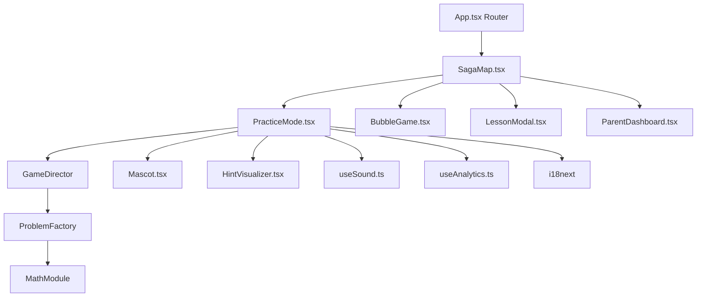

# System Overview & Data Flow

## Architecture pattern: Director-Module
Adaptive learning engine uses a "Smart Director" (`GameDirector`) that adjusts difficulty in real time based on performance, feeding `ProblemFactory` / `MathModule`.

## High-level data flow

## State & persistence
- **Context**: `ProfileContext`, `ProgressContext`, `ThemeContext` — global config/persistence.
- **localStorage keys**: `hebrew-math-profiles` (profiles), `hebrew_game_saga_progress_v1_<id>` (progress), themes.
- No backend login required — offline-first.

## Key engines (`src/engines/`)
- `MathModule.ts` / `ProblemFactory.ts` — problem generation (Bag Deck).
- `GameDirector.ts` — adaptive difficulty (rescue/challenge).
- `bubble/useGameEngine.ts` + `strategies/MathStrategy.ts` — bubble spawn engine.
- `invader/` — Math Invaders arcade mode.
- `SensoryFactory.ts` — sensory mode factory.
- `LessonEngine.ts` — story lessons.

## Firebase
- Hosting (primary deploy). Analytics (env-safe fallback to console mock via `src/lib/logger.ts`).
- Security: no `dangerouslySetInnerHTML`; validate all Firestore/Storage writes.

## Full feature inventory
See [[architecture/feature-inventory]] for the complete per-feature status table (works / partial / broken) with file locations.
